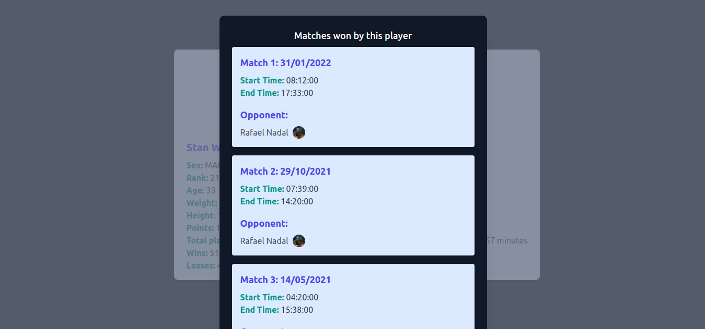
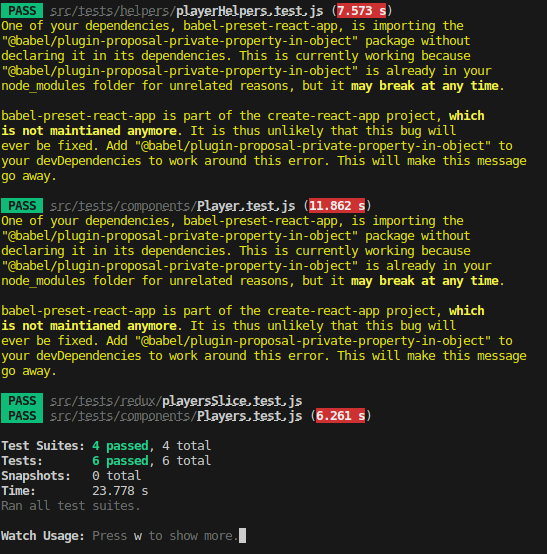
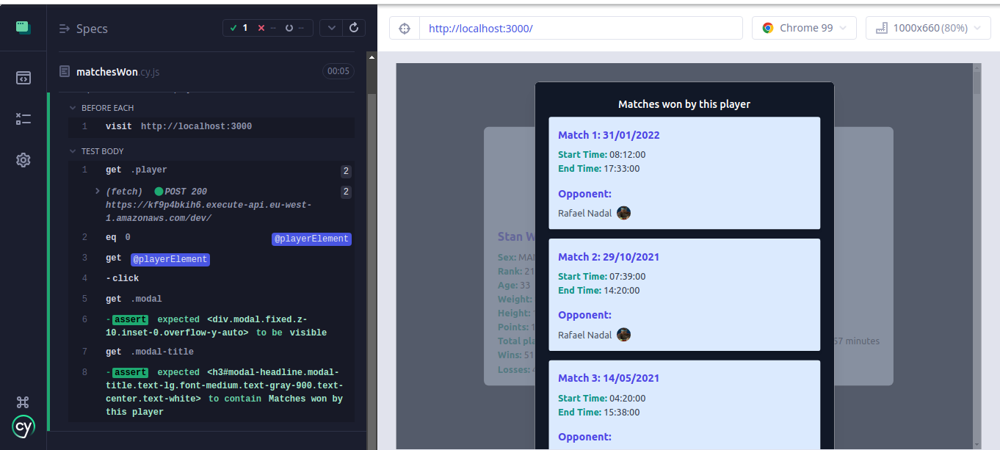

# Player Stats Web Application

This web application displays player statistics side by side, including total time played in matches, and allows users to view detailed information about winning games for each player. It is built using React, TypeScript, Redux Toolkit for state management, Tailwind CSS for styling, and consumes data from a GraphQL server.

## Table of Contents

1. [Screenshots](#screenshots)
2. [Tests](#tests)
3. [Project structure](#project-structure)
4. [Prerequisites](#prerequisites)
5. [Installation](#installation)
6. [Running the Application](#running-the-application)
7. [Testing](#testing)
8. [Folder Structure](#folder-structure)
9. [GraphQL Endpoint](#graphql-endpoint)
10. [Data Formatting](#data-formatting)

## Screenshots

Here are some screenshots of the Player Stats Web Application in action:




Here are some screenshots of unit/integration/e2e tests:




## Tests

### Unit Tests (Player.test.js)

This suite focuses on testing the individual components and helper functions within the Players component. It ensures that each component renders correctly and that the helper functions perform as expected.

- `should render player component without errors`: Verifies that the Player component renders without errors and checks various attributes within the component.

### Integration Tests (Players.test.js)

Integration tests check how different components interact with each other within the Players component. These tests are responsible for making sure that the component as a whole works as expected when its parts are combined.

- `renders players without error`: Checks if Player components are rendered correctly, ensuring the presence of specific attributes. Also, it verifies that the modal opens when clicking on a player.

### Unit Tests for Helper Functions (playerHelpers.test.js)

This suite tests the utility functions responsible for calculating playtime, wins, and losses.

- `calculateTotalPlayTime calculates correctly`: Verifies that the `calculateTotalPlayTime` function calculates the total playtime correctly.

- `getWinsAndLossesByPlayer calculates correctly`: Checks if the `getWinsAndLossesByPlayer` function correctly calculates the number of wins and losses.

- `getGamesWonByPlayer returns correct matches`: Ensures that the `getGamesWonByPlayer` function returns the correct matches won by a player.

### Redux Reducer Tests (playersSlice.test.js)

These tests focus on the Redux store and the associated reducer for the Players component.

- `should set players`: Verifies that the Redux action `setPlayers` correctly sets the players in the store.

### End-to-End Tests (matchesWon.cy.js)

End-to-end tests ensure that the Players component works as expected from a user's perspective. It simulates user interactions and checks if the UI behaves correctly.

- `Opens modal when a player is clicked`: Checks if clicking on a player opens a modal and verifies the content within the modal.

## Project structure

```plaintext
.
├── cypress
│   ├── e2e
│     └── matchesWon.cy.js
├── package.json
├── public
├── README.md
├── screenshots
├── src
│   ├── App.tsx
│   ├── components
│   │   ├── common
│   │   │   └── Modal.tsx
│   │   ├── Matches
│   │   │   ├── Matches.tsx
│   │   │   └── Match.tsx
│   │   └── Players
│   │   │   ├── Players.tsx
│   │   │   └── Player.tsx
│   ├── GraphQL
│   │   ├── api
│   │   │   ├── matchesApi.ts
│   │   │   └── playersApi.ts
│   │   ├── MatchQueries.tsx
│   │   └── PlayerQueries.tsx
│   ├── helpers
│   │   ├── dateHelpers.ts
│   │   └── playerHelpers.ts
│   ├── redux
│   │   ├── slices
│   │   │   ├── matchesSlice.ts
│   │   │   └── playersSlice.ts
│   │   └── store.ts
│   ├── tests
│   │   ├── components
│   │   │   ├── Players.test.js
│   │   │   └── Player.test.js
│   │   ├── helpers
│   │   │   └── playerHelpers.test.js
│   │   ├── redux
│   │   │   └── playersSlice.test.js
│   │   └── sampleData.ts
│   └── types.ts
```

## Prerequisites

Before you begin, ensure you have the following prerequisites installed on your system:

- Node.js and npm - You can download them [here](https://nodejs.org/).
- Git - You can download it [here](https://git-scm.com/).

## Installation

1. Clone the repository to your local machine using Git:

### git clone <repository_url>

2. Change into the project directory:

### cd <project_directory>

3. Install the project dependencies:

### npm install

## Running the Application

To start the application, run the following command:

### npm start

The application will be accessible in your browser at `http://localhost:3000`.

## Testing

This project includes both unit tests and end-to-end (e2e) tests. To run the tests, you can use the following commands:

- To run unit tests:

### npm test

- To run end-to-end tests (using Cypress):

### npm run e2e

Make sure you have Cypress installed globally or locally in your project before running the e2e tests.

## Folder Structure

The project is organized into the following main directories:

- `src`: Contains the source code for the application.
- `cypress`: Contains end-to-end tests.
- `tests`: Contains unit&integration tests.

## GraphQL Endpoint

This application consumes data from a GraphQL server. The GraphQL API queries are defined in the `src/GraphQL` directory, specifically in `MatchQueries.tsx` and `PlayerQueries.tsx`.

## Data Formatting

- Weight is displayed in kilograms.
- Height is displayed in meters.
- Total wins and losses are displayed separately.

Feel free to reach out if you have any questions or encounter issues while running the application.

---
