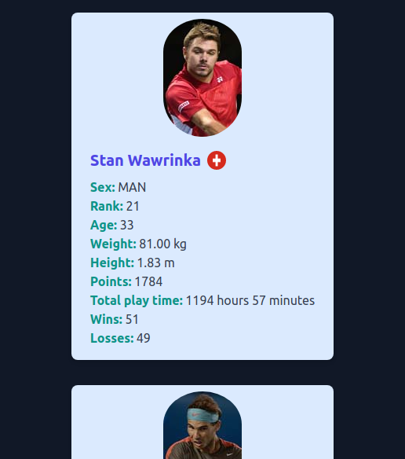

# Player Stats Web Application

This web application displays player statistics side by side, including total time played in matches, and allows users to view detailed information about winning games for each player. It is built using React, TypeScript, Redux Toolkit for state management, Tailwind CSS for styling, and consumes data from a GraphQL server.

## Table of Contents

1. [Screenshots](#screenshots)
2. [Prerequisites](#prerequisites)
3. [Installation](#installation)
4. [Running the Application](#running-the-application)
5. [Testing](#testing)
6. [Folder Structure](#folder-structure)
7. [GraphQL Endpoint](#graphql-endpoint)
8. [Data Formatting](#data-formatting)
9. [Linting](#linting)

## Screenshots

Here are some screenshots of the Player Stats Web Application in action:

## Prerequisites

Before you begin, ensure you have the following prerequisites installed on your system:

- Node.js and npm - You can download them [here](https://nodejs.org/).
- Git - You can download it [here](https://git-scm.com/).

## Installation

1. Clone the repository to your local machine using Git:

### git clone <repository_url>

2. Change into the project directory:

### cd <project_directory>

3. Install the project dependencies:

### npm install

## Running the Application

To start the application, run the following command:

### npm start

The application will be accessible in your browser at `http://localhost:3000`.

## Testing

This project includes both unit tests and end-to-end (e2e) tests. To run the tests, you can use the following commands:

- To run unit tests:

### npm test

- To run end-to-end tests (using Cypress):

### npm run e2e

Make sure you have Cypress installed globally or locally in your project before running the e2e tests.

## Folder Structure

The project is organized into the following main directories:

- `src`: Contains the source code for the application.
- `cypress`: Contains end-to-end tests.
- `tests`: Contains unit&integration tests.

## GraphQL Endpoint

This application consumes data from a GraphQL server. The GraphQL API queries are defined in the `src/GraphQL` directory, specifically in `MatchQueries.tsx` and `PlayerQueries.tsx`.

## Data Formatting

- Weight is displayed in kilograms.
- Height is displayed in meters.
- Total wins and losses are displayed separately.

Feel free to reach out if you have any questions or encounter issues while running the application.

---
